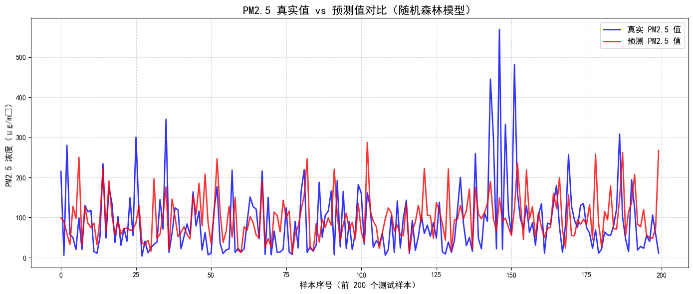
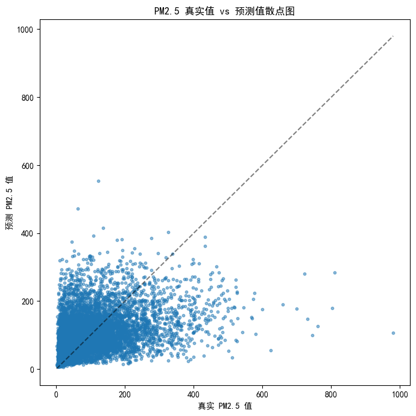

```python
import pandas as pd

# 正确读取（NA 会被自动识别为 NaN）
df = pd.read_csv(r'E:/Desktop/PRSA_data_2010.1.1-2014.12.31.csv', na_values='NA')

# 查看前几行
print(df.head())
print("\n字段名：")
print(df.columns.tolist())

```

       No  year  month  day  hour  pm2.5  DEWP  TEMP    PRES cbwd    Iws  Is  Ir
    0   1  2010      1    1     0    NaN   -21 -11.0  1021.0   NW   1.79   0   0
    1   2  2010      1    1     1    NaN   -21 -12.0  1020.0   NW   4.92   0   0
    2   3  2010      1    1     2    NaN   -21 -11.0  1019.0   NW   6.71   0   0
    3   4  2010      1    1     3    NaN   -21 -14.0  1019.0   NW   9.84   0   0
    4   5  2010      1    1     4    NaN   -20 -12.0  1018.0   NW  12.97   0   0
    
    字段名：
    ['No', 'year', 'month', 'day', 'hour', 'pm2.5', 'DEWP', 'TEMP', 'PRES', 'cbwd', 'Iws', 'Is', 'Ir']
    


```python
# ==============================
# 0️⃣ 数据清洗（关键步骤！）
# ==============================

# 方法一：直接删除 PM2.5 缺失的行（最简单）
df_model = df.dropna(subset=['pm2.5']).reset_index(drop=True)

# 同时也删除特征里有 NaN 的行（确保 X 也没有缺失值）
df_model = df_model.dropna(subset=['TEMP', 'PRES', 'Iws']).reset_index(drop=True)

print(f"清洗后数据量：{len(df_model)} 行")
print("缺失值检查：")
print(df_model[['pm2.5', 'TEMP', 'PRES', 'Iws']].isnull().sum())

# ==============================
# 1️⃣ 准备特征 X 和标签 y
# ==============================
X = df_model[['TEMP', 'PRES', 'Iws']]
y = df_model['pm2.5']

# ==============================
# 2️⃣ 拆分训练集和测试集
# ==============================
from sklearn.model_selection import train_test_split

X_train, X_test, y_train, y_test = train_test_split(
    X, y, test_size=0.2, random_state=42
)

print(f"训练集：{len(X_train)} 行")
print(f"测试集：{len(X_test)} 行")

# ==============================
# 3️⃣ 训练线性回归
# ==============================
from sklearn.linear_model import LinearRegression
from sklearn.metrics import mean_absolute_error, r2_score

lr_model = LinearRegression()
lr_model.fit(X_train, y_train)  # 现在应该不会报错了！

y_pred_lr = lr_model.predict(X_test)

print("===== 线性回归结果 =====")
print(f"R² 分数：{r2_score(y_test, y_pred_lr):.4f}")
print(f"MAE：{mean_absolute_error(y_test, y_pred_lr):.2f}")

# ==============================
# 4️⃣ 训练随机森林
# ==============================
from sklearn.ensemble import RandomForestRegressor

rf_model = RandomForestRegressor(n_estimators=100, random_state=42)
rf_model.fit(X_train, y_train)

y_pred_rf = rf_model.predict(X_test)

print("\n===== 随机森林结果 =====")
print(f"R² 分数：{r2_score(y_test, y_pred_rf):.4f}")
print(f"MAE：{mean_absolute_error(y_test, y_pred_rf):.2f}")

```

    清洗后数据量：41757 行
    缺失值检查：
    pm2.5    0
    TEMP     0
    PRES     0
    Iws      0
    dtype: int64
    训练集：33405 行
    测试集：8352 行
    ===== 线性回归结果 =====
    R² 分数：0.1195
    MAE：64.45
    
    ===== 随机森林结果 =====
    R² 分数：0.0794
    MAE：62.75
    


```python
# ==============================
# 第一步：设置中文字体，防止乱码
# ==============================

import matplotlib.pyplot as plt
import numpy as np

# Windows 系统设置中文字体（防止乱码）
plt.rcParams['font.sans-serif'] = ['SimHei', 'Microsoft YaHei']  # 黑体 / 微软雅黑
plt.rcParams['axes.unicode_minus'] = False  # 解决负号显示问题

# ==============================
# 第二步：只取前 200 个点画折线图（太多会太密）
# ==============================

# 如果测试集太大，折线图会挤在一起看不清
# 建议取前 200 条，或者你改成 500 也可以
n_points = 200
y_test_plot = y_test.iloc[:n_points]
y_pred_plot = y_pred_rf[:n_points]  # 如果用随机森林的结果
# y_pred_plot = y_pred_lr[:n_points]  # 如果用线性回归的结果

# 横轴：时间点（第 1 个、第 2 个...）
x = np.arange(len(y_test_plot))

# ==============================
# 第三步：画折线图
# ==============================

plt.figure(figsize=(14, 6))  # 设置画布大小

# 蓝色：真实值
plt.plot(x, y_test_plot, color='blue', linewidth=2, label='真实 PM2.5 值', alpha=0.8)

# 红色：预测值
plt.plot(x, y_pred_plot, color='red', linewidth=2, label='预测 PM2.5 值', alpha=0.8)

# ==============================
# 第四步：添加标题和标签
# ==============================

plt.title('PM2.5 真实值 vs 预测值对比（随机森林模型）', fontsize=16)
plt.xlabel('样本序号（前 200 个测试样本）', fontsize=12)
plt.ylabel('PM2.5 浓度（μg/m³）', fontsize=12)
plt.legend(fontsize=12)  # 显示图例
plt.grid(True, linestyle='--', alpha=0.5)  # 添加网格线

plt.tight_layout()  # 自动调整布局
plt.show()

```

    C:\Users\Orion\AppData\Local\Temp\ipykernel_20256\2338574205.py:48: UserWarning: Glyph 179 (\N{SUPERSCRIPT THREE}) missing from font(s) SimHei.
      plt.tight_layout()  # 自动调整布局
    E:\Anaconda\Lib\site-packages\IPython\core\pylabtools.py:170: UserWarning: Glyph 179 (\N{SUPERSCRIPT THREE}) missing from font(s) SimHei.
      fig.canvas.print_figure(bytes_io, **kw)
    


    

    


```python
plt.figure(figsize=(7, 7))

# 对角虚线：完美预测线（真实值=预测值）
plt.plot([y_test.min(), y_test.max()], [y_test.min(), y_test.max()], 'k--', alpha=0.5)

# 散点：真实值 vs 预测值
plt.scatter(y_test, y_pred_rf, alpha=0.5, s=10)

plt.title('PM2.5 真实值 vs 预测值散点图')
plt.xlabel('真实 PM2.5 值')
plt.ylabel('预测 PM2.5 值')
plt.tight_layout()
plt.show()

```


    

    


```python

```
