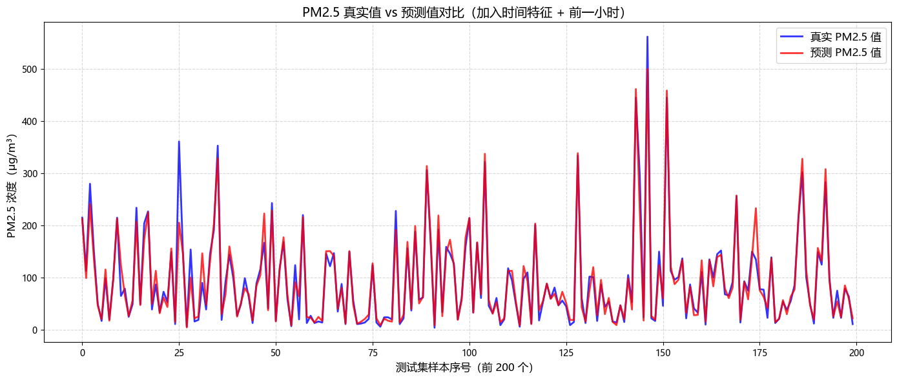

```python
# ===================================================
# 第一步：导入库
# ===================================================

import pandas as pd
import numpy as np
from sklearn.model_selection import train_test_split
from sklearn.ensemble import RandomForestRegressor
from sklearn.metrics import mean_absolute_error, r2_score
from sklearn.preprocessing import OneHotEncoder
from sklearn.compose import ColumnTransformer
import matplotlib.pyplot as plt
import warnings
warnings.filterwarnings('ignore')

# 中文字体设置
plt.rcParams['font.sans-serif'] = ['Microsoft YaHei', 'SimHei', 'sans-serif']
plt.rcParams['axes.unicode_minus'] = False

# ===================================================
# 第二步：重新读取并清洗数据
# ===================================================

df = pd.read_csv(r'E:/Desktop/PRSA_data_2010.1.1-2014.12.31.csv', na_values='NA')

# 删除 pm2.5 缺失的行
df = df.dropna(subset=['pm2.5']).reset_index(drop=True)

# ===================================================
# 第三步：创建"前一小时 PM2.5"特征（关键！）
# ===================================================

# 按时间排序（非常重要！）
df = df.sort_values(['year', 'month', 'day', 'hour']).reset_index(drop=True)

# 用 shift(1) 取前一行的 pm2.5 值
df['pm2.5_last_hour'] = df['pm2.5'].shift(1)

# 第一行没有"前一小时"，会是 NaN，把它删掉（只有一行，不影响）
df = df.dropna(subset=['pm2.5_last_hour']).reset_index(drop=True)

print("创建 pm2.5_last_hour 特征完成！")
print("前5行：")
print(df[['year','month','day','hour','pm2.5','pm2.5_last_hour']].head(10))

# ===================================================
# 第四步：准备特征（加入 month、hour、cbwd）
# ===================================================

# 数值特征（直接用）
numeric_features = ['TEMP', 'PRES', 'Iws', 'month', 'hour', 'pm2.5_last_hour']

# 类别特征（需要独热编码）
categorical_features = ['cbwd']

# 合并所有特征
X = df[numeric_features + categorical_features]
y = df['pm2.5']

print("\n特征列表：", numeric_features + categorical_features)
print("X 的形状：", X.shape)

# ===================================================
# 第五步：对 cbwd 进行独热编码（One-Hot Encoding）
# ===================================================

# 使用 ColumnTransformer + OneHotEncoder
# 对类别特征做独热编码，对数值特征保持不变
preprocessor = ColumnTransformer(
    transformers=[
        ('cat', OneHotEncoder(sparse_output=False, drop='first'), categorical_features)
        # drop='first' 防止多重共线性（可选）
    ],
    remainder='passthrough'  # 数值特征原样保留
)

# 先拟合，再转换
X_encoded = preprocessor.fit_transform(X)

print("\n独热编码后，特征数量：", X_encoded.shape[1])
print("编码后的前3行：")
print(X_encoded[:3])

# ===================================================
# 第六步：拆分训练集和测试集
# ===================================================

X_train, X_test, y_train, y_test = train_test_split(
    X_encoded, y, test_size=0.2, random_state=42
)

print(f"\n训练集：{X_train.shape[0]} 行，{X_train.shape[1]} 个特征")
print(f"测试集：{X_test.shape[0]} 行")

# ===================================================
# 第七步：训练随机森林（加入更多树，提高精度）
# ===================================================

rf_model = RandomForestRegressor(
    n_estimators=200,    # 200 棵树（原来 100）
    max_depth=20,        # 限制深度，防止过拟合
    random_state=42,
    n_jobs=-1            # 用全部 CPU 加速训练
)

rf_model.fit(X_train, y_train)
y_pred = rf_model.predict(X_test)

# ===================================================
# 第八步：评估模型
# ===================================================

r2 = r2_score(y_test, y_pred)
mae = mean_absolute_error(y_test, y_pred)

print("\n" + "="*40)
print("🎯 模型评估结果")
print("="*40)
print(f"R² 分数：{r2:.4f}")
print(f"MAE（平均误差）：{mae:.2f} μg/m³")
print("="*40)

# ===================================================
# 第九步：画真实值 vs 预测值对比图
# ===================================================

n_points = 200
plt.figure(figsize=(14, 6))

plt.plot(range(n_points), y_test.iloc[:n_points], 
         color='blue', linewidth=2, label='真实 PM2.5 值', alpha=0.8)
plt.plot(range(n_points), y_pred[:n_points], 
         color='red', linewidth=2, label='预测 PM2.5 值', alpha=0.8)

plt.title('PM2.5 真实值 vs 预测值对比（加入时间特征 + 前一小时）', fontsize=14)
plt.xlabel('测试集样本序号（前 200 个）', fontsize=12)
plt.ylabel('PM2.5 浓度（μg/m³）', fontsize=12)
plt.legend(fontsize=12)
plt.grid(True, linestyle='--', alpha=0.5)
plt.tight_layout()
plt.show()

```

    创建 pm2.5_last_hour 特征完成！
    前5行：
       year  month  day  hour  pm2.5  pm2.5_last_hour
    0  2010      1    2     1  148.0            129.0
    1  2010      1    2     2  159.0            148.0
    2  2010      1    2     3  181.0            159.0
    3  2010      1    2     4  138.0            181.0
    4  2010      1    2     5  109.0            138.0
    5  2010      1    2     6  105.0            109.0
    6  2010      1    2     7  124.0            105.0
    7  2010      1    2     8  120.0            124.0
    8  2010      1    2     9  132.0            120.0
    9  2010      1    2    10  140.0            132.0
    
    特征列表： ['TEMP', 'PRES', 'Iws', 'month', 'hour', 'pm2.5_last_hour', 'cbwd']
    X 的形状： (41756, 7)
    
    独热编码后，特征数量： 9
    编码后的前3行：
    [[ 0.000e+00  1.000e+00  0.000e+00 -4.000e+00  1.020e+03  2.680e+00
       1.000e+00  1.000e+00  1.290e+02]
     [ 0.000e+00  1.000e+00  0.000e+00 -5.000e+00  1.021e+03  3.570e+00
       1.000e+00  2.000e+00  1.480e+02]
     [ 0.000e+00  1.000e+00  0.000e+00 -5.000e+00  1.022e+03  5.360e+00
       1.000e+00  3.000e+00  1.590e+02]]
    
    训练集：33404 行，9 个特征
    测试集：8352 行
    
    ========================================
    🎯 模型评估结果
    ========================================
    R² 分数：0.9277
    MAE（平均误差）：13.39 μg/m³
    ========================================
    


    

    


```python

```
